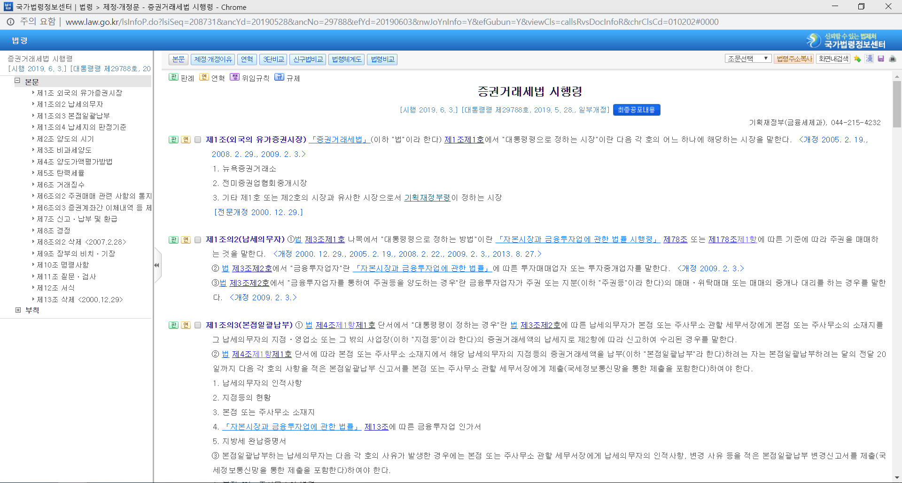
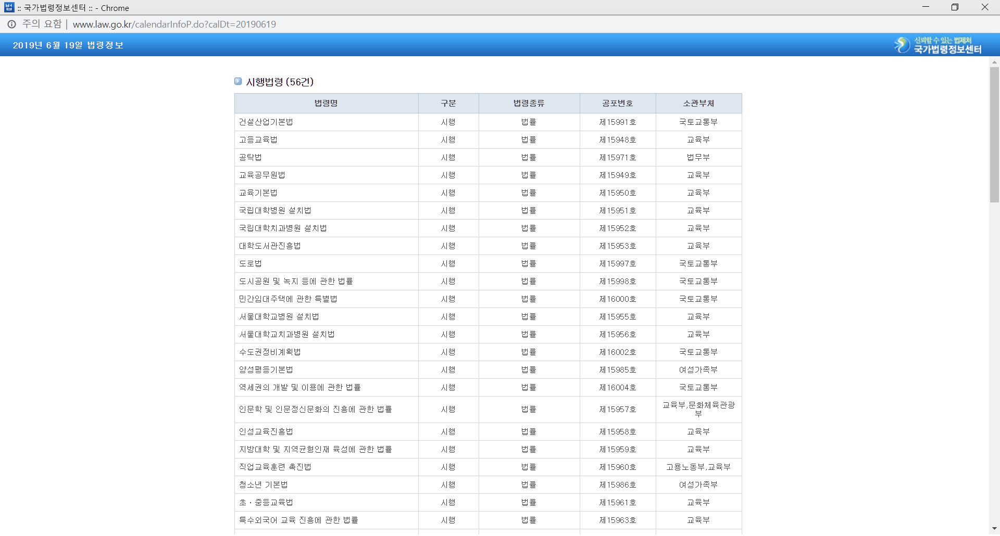

# api
----

## getlawcontent

* How to use

/법령?(law name)

/행정규칙?(law name)

/자치법규?(law name)

* example

/법령?증권거래세법 시행령

/행정법규?119 소방 강령

/자치법규?2016 코리아문화수도 시흥 사업 지원 조례

## getnewlaw

* How to use

/newlaw?(date)

* example

/newlaw?20190301
